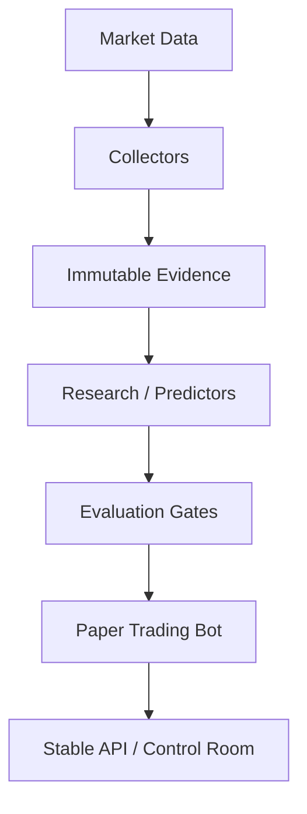
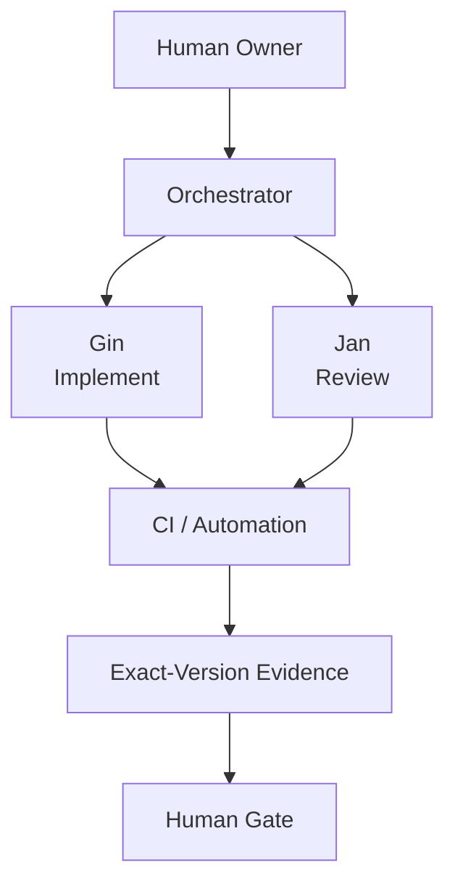

# Dobrin Rashkov

### Application Support Engineer → AI Systems & Automation

**Building reliable systems where humans, AI agents, and automation work together.**

`DOBRI AI LAB` · reliable automation · observable workflows · human-controlled AI

I work at the intersection of production support, software engineering, and AI-assisted development. I build systems that are reproducible, observable, reviewable, and safe to operate.

## Currently building

- **🤖 Dobri AI Orchestrator** — A multi-agent workflow controller under active development, designed around persistent state, provider abstraction, review boundaries, usage and capacity awareness, and human approval gates.
- **📈 Trading Bot Lab** — A paper-first automated research platform with reproducible evidence, isolated execution, deterministic validation, and fail-closed safety.
- **⚙️ Engineering Infrastructure** — Reliable automation, testing, deployment, observability, and AI-assisted engineering workflows.

## Featured engineering

### [Trading System Case Study](https://github.com/rashkov09/trading-system-case-study)

A paper-first research platform designed around deterministic testing, immutable and versioned evidence, isolated execution, reproducible deployment, stable APIs, and fail-closed safety.

The implementation remains private; the public case study documents the architecture and engineering decisions without exposing operational details or execution code.

### Dobri AI Orchestrator

**Case study coming soon.** A controlled multi-agent engineering system where implementers and reviewers operate through explicit workflow state, exact-version evidence, provider telemetry, CI, and human gates.

## System architecture

Reproducible evidence connects the research system end to end: inputs, revisions, evaluation decisions, runtime identity, and outcomes remain traceable.

## Dobri AI Lab workflow

Dobri AI Orchestrator is under active development. The intended workflow keeps implementation, review, automation, evidence, and final authority separate.

## Tech stack

  
  
  
  
  
  
  

## How I engineer

- **Reproducible** — Deterministic results, exact versions, and immutable evidence.
- **Fail closed** — Missing or inconsistent evidence stays unknown rather than becoming false confidence.
- **Practical automation** — Use automation and AI to remove repetitive work without removing human ownership.
- **Continuous improvement** — Measure, review, learn, and iterate.

My application-support background shapes these principles: failures should be visible, important decisions traceable, deployments reversible, and consequential changes subject to clear technical and human boundaries.

## Earlier work

This account also contains earlier Java, database, university, and learning projects. They show where the journey started; the current systems work shows where it is heading.

---

> “I automate repetitive work because I'd rather spend the time solving the next problem.”
